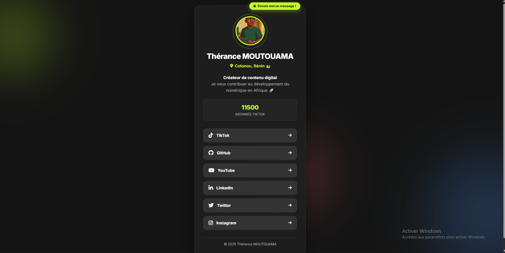

# 🔗 Linktree - Thérance MOUTOUAMA

Un profil de liens sociaux moderne et interactif, inspiré de Linktree, avec des animations fluides et un design glassmorphism.



## 🎯 Aperçu

Ce projet est un linktree personnalisé qui regroupe tous mes liens de réseaux sociaux en un seul endroit. Avec un design moderne, des animations CSS avancées et une interface utilisateur intuitive.

### ✨ Fonctionnalités

- 🎨 **Design Glassmorphism** - Effet de verre moderne avec transparence et flou
- 🌈 **Arrière-plan animé** - Orbes de dégradés flottants pour un effet dynamique
- ⚡ **Animations fluides** - Transitions et micro-interactions sur tous les éléments
- 📊 **Statistiques en temps réel** - Affichage des abonnés TikTok
- 🎭 **Badge de disponibilité** - Indicateur animé pour les projets
- 🔄 **Effet parallaxe 3D** - La carte réagit au mouvement de la souris
- 🎯 **Hover effects** - Chaque réseau social a sa couleur signature
- 📱 **100% Responsive** - Optimisé pour tous les appareils
- ♿ **Accessible** - Support de `prefers-reduced-motion`
- 🎁 **Easter Egg** - Konami Code caché (↑↑↓↓←→←→BA)

## 🛠️ Technologies utilisées

- **HTML5** - Structure sémantique
- **CSS3** - Animations, Grid, Flexbox, Glassmorphism
- **JavaScript Vanilla** - Interactions et animations dynamiques
- **Font Awesome 6.5.1** - Icônes des réseaux sociaux
- **Google Fonts (Inter)** - Typographie moderne

## 🚀 Démarrage rapide

### Prérequis

Aucun ! Juste un navigateur web moderne.

### Installation

1. Clone le repository
```bash
git clone https://github.com/Therax1/LinkTree3D.git
```

2. Navigue dans le dossier
```bash
cd LinkTree3D
```

3. Ouvre `index.html` dans ton navigateur
```bash
# Sur Windows
start index.html

# Sur Mac
open index.html

# Sur Linux
xdg-open index.html
```

Ou simplement double-clique sur le fichier `index.html`.

## 📁 Structure du projet

```
social-links-profile-main/
│
├── index.html          # Page principale
├── styles.css          # Styles et animations
├── script.js           # Interactions JavaScript
├── README.md           # Documentation
│
├── assets/
│   ├── fonts/         # Polices (Inter)
│   └── images/
│       └── myPp.jpeg  # Photo de profil
│
└── design/            # Maquettes et designs de référence
```

## 🎨 Personnalisation

### Modifier les informations personnelles

Dans `index.html`, modifie les sections suivantes :

```html
<!-- Nom et localisation -->
<h1 class="userName">Ton Nom</h1>
<p class="location">
  <i class="fas fa-map-marker-alt"></i>
  Ta Ville, Ton Pays <span class="flag">🏴</span>
</p>

<!-- Description -->
<p class="description">
  <strong>Ton titre</strong><br>
  Ta description 🚀
</p>

<!-- Statistiques -->
<span class="stat-number">XX.XK+</span>
<span class="stat-label">Tes Stats</span>
```

### Modifier les liens des réseaux sociaux

Remplace les URL dans les balises `<a>` :

```html
<a href="https://www.tiktok.com/@ton_pseudo" ...>
<a href="https://github.com/ton_username" ...>
<!-- etc. -->
```

### Personnaliser les couleurs

Dans `styles.css`, modifie les variables CSS :

```css
:root {
    --primary: #c5f82a;        /* Couleur principale */
    --grey-800: hsl(0, 0%, 12%); /* Couleur de la carte */
    --text: #ffffff;            /* Couleur du texte */
    
    /* Couleurs des réseaux sociaux */
    --tiktok: #000000;
    --github: #333;
    --youtube: #FF0000;
    /* etc. */
}
```

### Ajouter un nouveau réseau social

1. Ajoute le lien HTML dans la section `.card__socials` :
```html
<a href="URL" class="card__social-link card__social-link--RESEAU" target="_blank">
  <i class="fab fa-ICON"></i>
  <span>Nom du réseau</span>
  <i class="fas fa-arrow-right arrow-icon"></i>
</a>
```

2. Ajoute la couleur dans `styles.css` :
```css
:root {
    --RESEAU: #COULEUR;
}

.card__social-link--RESEAU:hover {
    background: var(--RESEAU);
    color: var(--text);
}
```

## 🎭 Fonctionnalités avancées

### Animations au chargement

Chaque élément apparaît progressivement avec un délai décalé pour un effet fluide :
- Carte : 0.8s
- Badge : 1s
- Image : 1s
- Infos : 1s
- Statistiques : 1.2s
- Liens sociaux : 0.7s → 1.1s (décalés)

### Effet parallaxe 3D

La carte réagit au mouvement de la souris avec un effet de rotation 3D subtil.

### Compteur animé

Les statistiques s'animent au défilement avec un effet de compteur incrémental.

### Easter Egg - Konami Code

Tape la séquence : ↑↑←→ pour déclencher un effet arc-en-ciel ! 🌈

## 📱 Responsive Design

Le design s'adapte automatiquement à toutes les tailles d'écran :
- 📱 Mobile : < 480px
- 💻 Desktop : > 480px

## ♿ Accessibilité

- Support du mode `prefers-reduced-motion` pour les utilisateurs sensibles aux animations
- Alt text sur toutes les images
- Structure HTML sémantique
- Contrastes de couleurs respectés
- Navigation au clavier possible

## 🐛 Problèmes connus

- L'effet parallaxe 3D ne fonctionne pas sur les appareils tactiles (comportement normal)
- Les orbes en arrière-plan peuvent ralentir les navigateurs très anciens

## 🔮 Améliorations futures

- [ ] Mode clair/sombre avec toggle
- [ ] Compteur en temps réel des abonnés (API)
- [ ] Thèmes de couleurs multiples
- [ ] Partage du profil (QR Code)
- [ ] Analytics des clics
- [ ] Support multilingue

## 🤝 Contribution

Les contributions sont les bienvenues ! N'hésite pas à :
1. Fork le projet
2. Créer une branche (`git checkout -b feature/FonctionnaliteIncroyable`)
3. Commit tes changements (`git commit -m 'J'ai ajouté un gros truc 😁'`)
4. Push sur la branche (`git push origin feature/FonctionnaliteIncroyable`)
5. Ouvrir une Pull Request

## 📝 Licence

Ce projet est sous licence MIT. Tu es libre de l'utiliser, le modifier et le distribuer.

## 👤 Auteur

**Thérance MOUTOUAMA**

- 🌐 Portfolio : [En construction]
- 💼 LinkedIn : [Thérance MOUTOUAMA](https://www.linkedin.com/in/th%C3%A9rance-moutouama-9912222a1)
- 🐙 GitHub : [@Therax1](https://github.com/Therax1)
- 📺 YouTube : [@theranxe](https://www.youtube.com/@theranxe)
- 🎵 TikTok : [@therancetech](https://www.tiktok.com/@therancetech)
- 📸 Instagram : [@therax_0n](https://www.instagram.com/therax_0n)
- 🐦 Twitter : [@original_rax](https://twitter.com/@original_rax)

## 🙏 Remerciements

- Frontend Mentor pour l'inspiration du défi
- Font Awesome pour les icônes
- Google Fonts pour la typographie Inter
- La communauté dev pour les feedbacks
- Copilot pour m'avoir aider à relancer le projet 😂 (sérieusement)

## 📊 Stats du projet

- 📦 Taille : ~20 KB (HTML + CSS + JS)
- 🎨 Design : Glassmorphism moderne
- 🔧 Maintenance : Active

---

⭐ **Si ce projet t'a plu, n'oublie pas de lui donner une étoile !**

💬 **Des questions ? Ouvre une issue ou contacte-moi directement !**

**Fait avec ❤️ et beaucoup de ☕**
